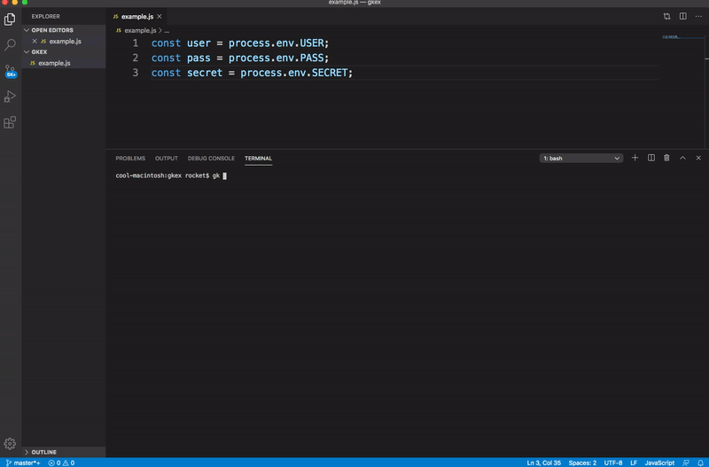

# gatekeepercli

*Environment Variables Done Right*

### Why Would You Use This?

This CLI is especially useful if you just cloned a repository and it has a javascript or javascript file(s) that have many environment variables defined.

### Installation

`$ npm install -g gatekeepercli`

### Usage

`$ gk create [filename]`

Creates `.env` file for single javascript file:
 - `[filename]` is the javascript file you would like to get the env vars from

`$ gk createDir [directory]`

Creates `.env` file for all javascript files in a directory:
 - `[directory]` is the directory you would like to get the env vars from

`$ gk gitignore [dir]`

Adds `.env` to existing or nonexisting gitignore
  - `[dir]` is the directory that the `.gitignore` file is located
    - the default directory if `[dir]` is left blank is `root` or `/`

`$ gk createRev [file] [dir] [filename]`

Creates `.js` file with variables based off of variables in a `.env` file
  - `[file]` is the path to the `.env` file
  - `[dir]` is the directory you want to save the new `.js` file to.
    - directory can be nonexistent
  - `[filename]` is the name of the new `.js` file
    - example: `$ gk createRev .env newjsfiledir env.js`

`$ gk travis [dir] [travDir]`

Adds environment variables to `.travis.yml` file
  - `[dir]` is the directory in which your `.env` file is located
  - `[travDir]` is the directory in which your `.travis.yml` file is located
    - if there is no `.travis.yml` file, a blank one will be created in the specified directory
    - leaving this blank will default the directory to `root` or `/`